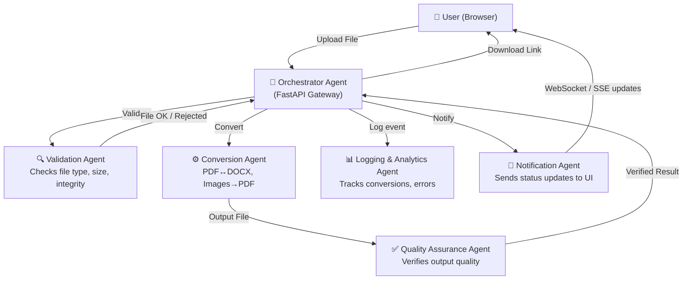

# 🚀 Convertify — Complete Project Guide

## Part 1: How to Run the Project (Step-by-Step)

The project has **two parts** that must run simultaneously:
- **Backend** — Python FastAPI server (port 8000)
- **Frontend** — React + Vite dev server (port 5173)

---

### 🐍 Step 1: Run the Backend

Open a **PowerShell / Terminal** in the project root.

```powershell
# Navigate to the backend folder
cd "e:\Naresh Projects\File Converter\backend"

# Activate the virtual environment
.\venv\Scripts\Activate

# Install dependencies (first time only)
pip install -r requirements.txt

# Start the FastAPI server
python main.py
```

✅ You should see:
```
INFO:     Uvicorn running on http://127.0.0.1:8000 (Press CTRL+C to quit)
```

> [!IMPORTANT]
> Keep this terminal open. The backend must be running for conversions to work.

> [!NOTE]
> **DOCX → PDF** conversion requires **Microsoft Word** installed on your machine. The other conversions (PDF→DOCX, Images→PDF) work without Word.

---

### ⚛️ Step 2: Run the Frontend

Open a **second PowerShell / Terminal** window (keep the backend one open!).

```powershell
# Navigate to the frontend folder
cd "e:\Naresh Projects\File Converter\frontend"

# Install npm packages (first time only)
npm install

# Start the Vite dev server
npm run dev
```

✅ You should see:
```
  VITE v6.x.x  ready in xxx ms

  ➜  Local:   http://localhost:5173/
  ➜  Network: use --host to expose
```

---

### 🌐 Step 3: Open the App

Open your browser and go to:
```
http://localhost:5173
```

🎉 **Convertify is now running!**

---

### ❗ Troubleshooting

| Problem | Fix |
|---------|-----|
| `venv\Scripts\Activate` fails | Run: `Set-ExecutionPolicy -ExecutionPolicy RemoteSigned -Scope CurrentUser` |
| Port 8000 already in use | Kill old process or change port in `main.py` |
| `npm: command not found` | Install Node.js from [nodejs.org](https://nodejs.org) |
| Backend shows module errors | Re-run `pip install -r requirements.txt` in activated venv |
| CORS errors in browser | Ensure backend is running at `127.0.0.1:8000` |

---

## Part 2: Download Feature ✅

**Good news — the download feature is already built in!**

Here's how it works:

1. Upload your file and click **Convert**
2. After conversion, a green ✅ success screen appears
3. A prominent **"⬇ Download File"** button lets you save the file to your system
4. The **Session History** panel (right side) also has individual download icons for every converted file

The download is triggered via an `<a href="..." download="filename">` tag using a browser `Blob URL` — no server storage needed.

> [!TIP]
> Files in the session history are downloadable until you **refresh the page**. After refresh, the blob URLs are gone (by design — for privacy).

---

## Part 3: New AI-Generated Logo 🎨

A unique **SVG logo component** has been added at:
```
frontend/src/components/Logo.jsx
```

### Logo Design Details:
- **Two document icons** with exchanging arrows — symbolizing file conversion
- **Gradient**: Deep Indigo `#4F46E5` → Emerald Green `#10B981`
- **Glow filter** effect on the arrows for a premium neon feel
- **Rounded square** background — like a modern app icon
- Renders both as a **standalone icon** or **with the "Convertify" text**

### How to use it:
```jsx
// Icon only
<ConvertifyLogo size={40} />

// Icon + brand name text
<ConvertifyLogo size={40} showText={true} />
```

The logo is now **live in the header** of the app, replacing the old plain indigo square.

---

## Part 4: Multi-Agent Architecture Upgrade 🤖

### What is a Multi-Agent System?

Instead of one monolithic backend, you split work across multiple **specialized AI agents**, each with a specific role. They communicate through a shared message queue or orchestrator.

---

### Proposed Multi-Agent Architecture for Convertify



---

### Agents Breakdown

| Agent | Role | Tech |
|-------|------|------|
| **Orchestrator** | Routes requests, coordinates agents | FastAPI + LangGraph or CrewAI |
| **Validation Agent** | Checks file type, size, corruption | Python magic-bytes + pydantic |
| **Conversion Agent** | Actual file format conversion | pdf2docx, Pillow, docx2pdf |
| **QA Agent** | Verifies output isn't corrupt/empty | File size, page count checks |
| **Logging Agent** | Stores metrics, errors, usage stats | SQLite / Redis |
| **Notification Agent** | Pushes real-time status to UI | WebSocket / Server-Sent Events |

---

### Upgrade Roadmap (3 Phases)

#### Phase 1 — Modularize (Current → Services)
- Split each `if` block in `main.py` into its own **microservice file**
- Add an `AgentRouter` class that dispatches based on conversion type

#### Phase 2 — Add LLM Intelligence
- Use **LangChain / LangGraph** to create an orchestrator that reads file metadata
- Add a **Smart Agent** that auto-detects the best conversion type from just the file
- Example: Drop any file → AI picks the right conversion automatically

#### Phase 3 — Async + Real-Time
- Switch to **Celery + Redis** for background task queuing
- Add **WebSocket** support so the frontend shows real-time agent activity
- Deploy each agent as a separate **Docker container** (microservices)

---

### Recommended Tools & Frameworks

| Purpose | Tool |
|---------|------|
| Agent Orchestration | [LangGraph](https://github.com/langchain-ai/langgraph), [CrewAI](https://crewai.com) |
| Task Queue | Celery + Redis |
| Real-time Updates | FastAPI WebSockets |
| AI File Detection | OpenAI / Gemini API |
| Containerization | Docker + Docker Compose |

---

> [!TIP]
> Start with **Phase 1** — it gives you a cleaner codebase without any external dependencies. Then add LLM intelligence in Phase 2 once the structure is solid.
